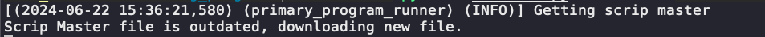
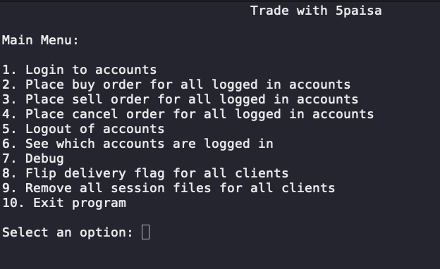

# Trading Program

This repository contains a trading program with various components, including data handling, logging, and multiple sub-programs to manage different aspects of trading operations.

## Table of Contents

- [Trading Program](#trading-program)
  - [Table of Contents](#table-of-contents)
  - [Project Structure](#project-structure)
  - [Installation](#installation)
  - [Usage](#usage)
  - [Configuration](#configuration)
  - [Data Files](#data-files)
  - [Logging](#logging)
  - [Source Code](#source-code)
  - [Running the program](#running-the-program)
  - [Additional Information](#additional-information)

## Project Structure

The project directory structure is as follows:

```
trading_program
├── data
│ ├── ScripMaster.csv
│ ├── PROFILE_NAME_1
│ ├── PROFILE_NAME_2
│ ├── PROFILE_NAME_N
├── logs
│ ├── primary_program_runner
│ ├── program_background
│ ├── program_display
│ ├── program_login
│ ├── program_orders
│ ├── program_quotes
├── .gitignore
├── Pipfile
├── Pipfile.lock
├── README.md
├── src
│ ├── init.py
│ ├── main.py
│ ├── program_background.py
│ ├── program_client_profile.py
│ ├── program_constants.py
│ ├── program_display.py
│ ├── program_helpers.py
│ ├── program_login.py
│ ├── program_orders.py
│ ├── program_quotes.py
│ ├── program_secrets.py
│ └── temp_file.py
└── .vscode
└── settings.json
```


## Installation

1. Clone the repository:
    ```sh
    git clone https://github.com/your_username/trading_program.git
    cd trading_program
    ```

2. Install dependencies using Pipenv:
    ```sh
    pipenv install
    ```

## Usage

1. Activate the virtual environment:
    ```sh
    pipenv shell
    ```

2. Run the main program:
    ```sh
    python src/main.py
    ```

## Configuration

Configuration files for various programs and services are stored in the `src` directory. Key files include:

- `program_constants.py`: Contains constants used across the program.
- `program_secrets.py`: Stores sensitive information and credentials.

## Data Files

Data files are stored in the `data` directory. It includes CSV and JSON files with various trading data and configurations.

- `ScripMaster.csv`: Master file for scripts.
- `PROFILE_NAME_1`, `PROFILE_NAME_2` and `PROFILE_NAME_N` directories contain JSON files related to different trading instruments and positions.

## Logging

Log files are organized into subdirectories within the `logs` directory, categorized by different components of the program:

- `primary_program_runner`: Logs related to the primary program runner.
- `program_background`: Logs related to background operations.
- `program_display`: Logs related to the display module.
- `program_login`: Logs related to the login module.
- `program_orders`: Logs related to order management.
- `program_quotes`: Logs related to market quotes.

## Source Code

The source code is located in the `src` directory and includes various modules that handle different aspects of the trading program:

- `main.py`: The main entry point of the program.
- `program_background.py`: Handles background operations.
- `program_client_profile.py`: Manages client profiles.
- `program_constants.py`: Contains program constants.
- `program_display.py`: Manages display operations.
- `program_helpers.py`: Contains helper functions.
- `program_login.py`: Manages user login.
- `program_orders.py`: Handles order management.
- `program_quotes.py`: Manages market quotes.
- `program_secrets.py`: Stores sensitive information and credentials.
- `temp_file.py`: Temporary file for testing or development purposes.

## Running the program

- First time run will download the scrip file


- Main menu screenshot


## Additional Information

For more detailed information on how to use each component, please refer to the individual module documentation within the source code.
